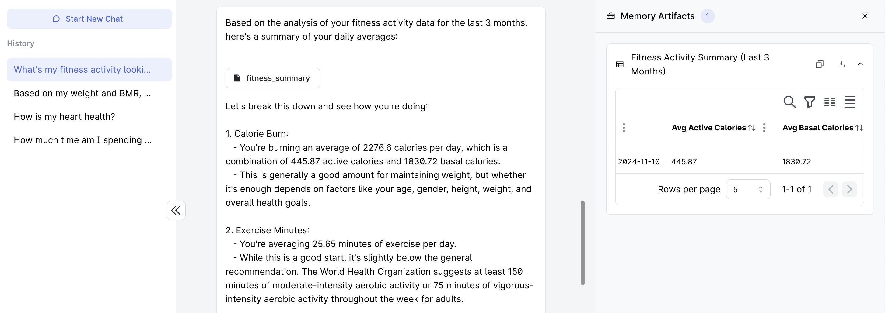
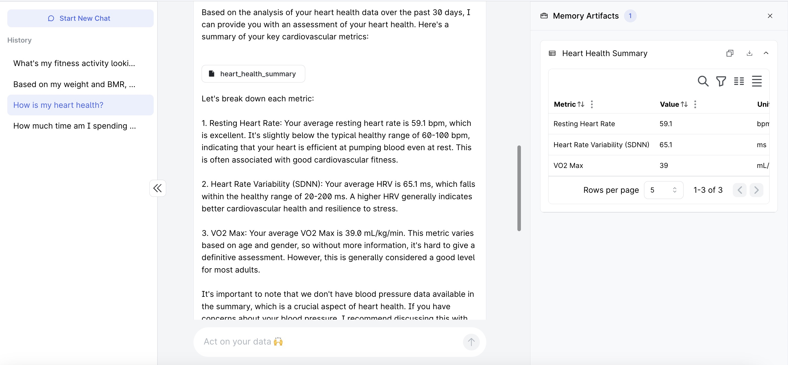
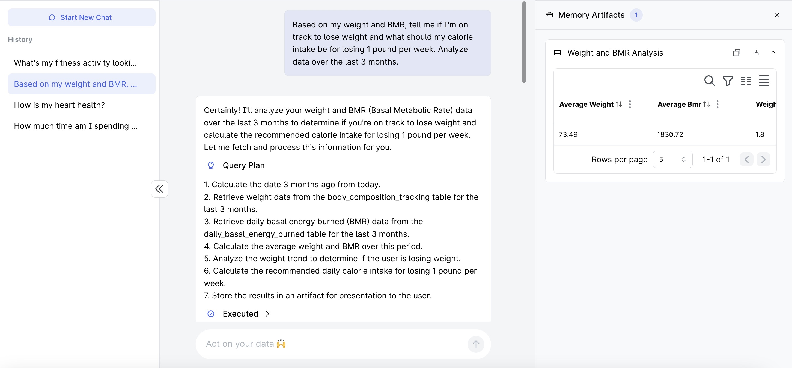
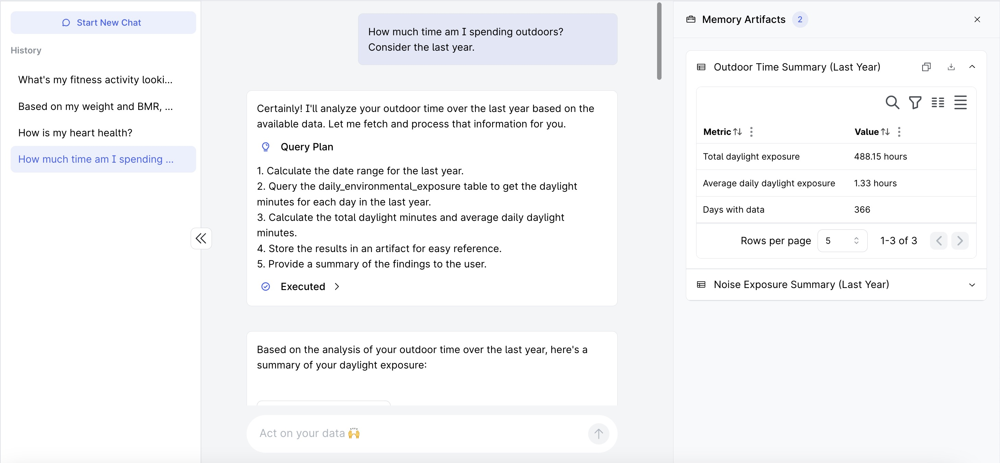

# Apple Health AI Assistant

[](https://promptql.hasura.io)
[](https://www.python.org/downloads/release/python-360/)

Explore your Apple Health data in natural language to get personalized insights.

Here's a sample of what you can ask:
- What's my average walking per day?
- How much time am I spending outdoors?
- Based on my weight and BMR, tell me if I'm on track to lose weight and what should my calorie intake be for losing 1 pound per week. Analyze data over the last 3 months.
- Am I being exposed to a lot of noise in the environment? Check the impact on my hearing health.
- How is my heart health?
- How active have I been over the last few months? Are there any patterns and anomalies in my activity?
- How much exercise activity did I do in the last year? What's the trend looking like?

<p align="center">
  
  
  
  
</p>

## Quick Setup

**Step 1**: Export Apple Health data from Apple iPhone:

> [Docs from Apple](https://support.apple.com/guide/iphone/share-your-health-data-iph5ede58c3d/ios#iphe962dcbd2)

- Go to the Health app on your iPhone.
- Tap your picture or initials at the top right.
- If you don’t see your picture or initials, tap Summary or Browse at the bottom of the screen, then scroll to the top of the screen.
- Tap Export All Health Data, then choose a method for sharing your data. If you have a Macbook, share via AirDrop for quickly getting started. Else, use Google Drive to save and download. 

The export can take some time depending on how much data you have. Ensure your phone doesn't lock during the export to prevent interruption.

**Step 2**: Clone repo
```bash
git clone git@github.com:praveenweb/apple-health-ai-assistant.git
cd apple-health-ai-assistant
```

**Step 3**: Copy Apple Health `export.zip`

- Copy the `export.zip` file that was obtained from the Apple Health export above into the root directory of the git repo we just cloned now.

The directory structure should look like this:

```bash
├── Dockerfile
├── README.md
├── ddn-project
├── docker-compose.yaml
├── export.zip ---- this is where your apple health export.zip should live
├── formatters.py
├── parse.py
├── requirements.txt
├── schema.sql
└── test-data
    └── export.zip
```

If you want to quickly test with dummy data, you can copy the `export.zip` available inside `test-data` to the root directory.

**Step 4**: Configure environment variables

```bash
cp .env.sample .env
```

The default Postgres credentials should work. Feel free to change it as necessary.

**Step 5**: Start services using docker compose.

```bash
docker compose up -d --build
```

The python service will parse the `export.zip` file, unpack and parse the `export.xml` inside that contains all the raw data from Apple Health. The data is parsed to a CSV and then in turn imported into a Postgres Database.

**Note**: Depending on how big your health export is, it should take anywhere between 30 seconds to 2 minutes to fully import the data. The schema will be initialized quickly and the data import happens in the background, so you can proceed to follow the steps below.

**Step 6**: Setup Hasura DDN project with PromptQL

Now, let's setup the Hasura DDN project with PromptQL to start exploring the data in natural language.

**Pre-requisite**
- [Install Hasura DDN CLI](https://hasura.io/docs/3.0/cli/installation/)
- Update CLI to the latest alpha. Temporary to enable the PromptQL interface.

```bash
ddn update-cli --version v2.12.0-alpha.2
```

Setup Hasura DDN project

```bash
cd ddn-project
ddn supergraph build local
ddn project init
echo 'ANTHROPIC_API_KEY=your-anthropic-api-key' >> .env
ddn run docker-start
```

In the above step, make sure to configure the `ANTHROPIC_API_KEY`.

**Step 7**: Open DDN Console to start exploring PromptQL.

```bash
ddn console --local
```

This should open up your browser (or print a browser URL) for opening up your console. It’ll typically be something like: [https://console.hasura.io/local?engine=localhost:3280&promptql=localhost:3282](https://console.hasura.io/local?engine=localhost:3280&promptql=localhost:3282)

Head over to the console and say hi to your AI!

```
> Hi, what can you do for me?
```

## Cleanup and restart

If you want to cleanup the data and restart from scratch, just do this

```bash
docker compose down -v && docker compose up -d --build
```

## Known issues and things to consider

- It is not uncommon to have invalid `export.xml` from Apple Health. Use an XML Validator to remove the broken lines. Usually it is at the XML schema declaration at the beginning.
- Since multiple sources record the same data, the LLMs could use the duplicate data for calculations, resulting in inflated metrics. Though context has been provided through metadata, it is recommended to check out the query execution plan to see if the right grouping and filters are done if you spot any anomalies.
- This has been tested on newer versions of iOS. Untested on old versions (iOS < 15.0). But the XML schema is more or less the same foundation over the years.
- Works best when external devices like Apple Watch or other fitness trackers are used since that captures the most amount of data in Apple Health outside the basic measurements that iPhone captures.

## Prior work

Apple Health parsers have been written in the past to handle different use cases. Some inspiration and references came from these projects
- [apple-health-grafana](https://github.com/k0rventen/apple-health-grafana)
- [atlas](https://github.com/atlaslib/atlas)

